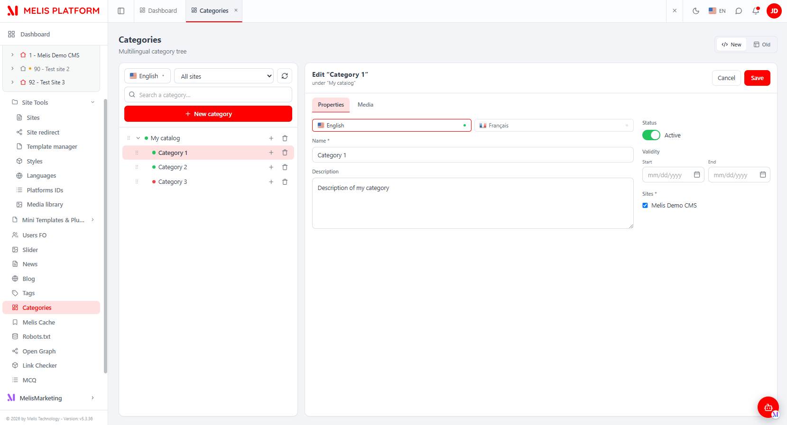
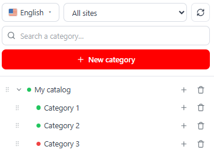
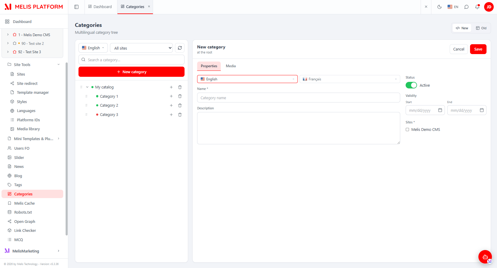
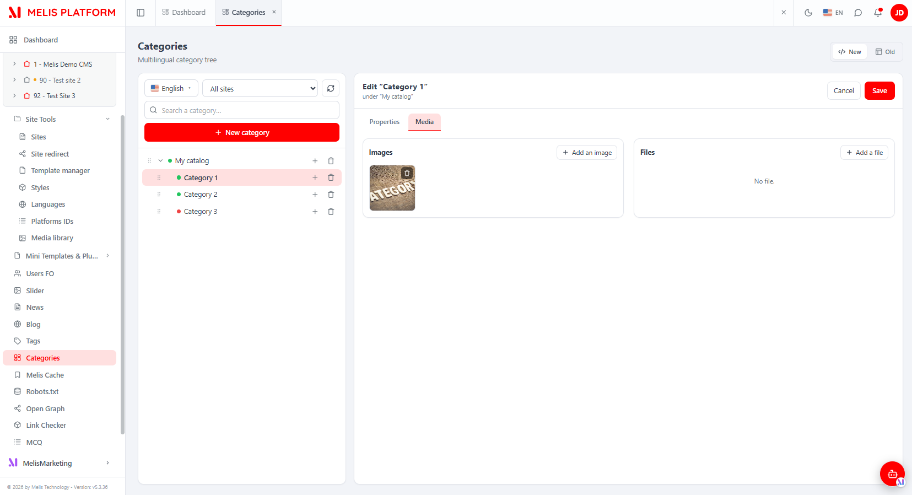
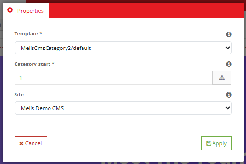

# MelisCmsCategory2 (React back-office) — Functional & Technical Documentation (for AI)

> **What this is.** MelisCmsCategory2 is the **category / catalog system** of Melis — a tree of
> catalogs and categories (multilingual, multi-site, with attached media) used to classify
> content. This document covers it **in the new React back-office** (`/melis-react`): the module
> ships a **native full-React brick** — a real **master-detail** React UI (category tree on the
> left, tabbed editor on the right) reading/writing through its own `react-api` JSON layer — with
> a **New / Old toggle** that can fall back to the legacy tool in an iframe. For the underlying data
> model, services, the front-end **Display Categories** plugin and the reusable category picker, see
> the [legacy tool doc](./MelisCmsCategory2.md); this doc does not repeat them.
>
> **How this document is organised — two clearly separated parts:**
> - **[Part A — Functional Guide](#part-a--functional-guide)** — for everyday users (and the
>   chat assistant) using the React back-office. Plain language.
> - **[Part B — Technical Reference](#part-b--technical-reference)** — for developers and AI
>   building inside the React UI, with code (brick manifest, endpoints, capabilities).
>
> **Audience**: consumed by the **MelisAI** MCP. **Status**: reviewed 2026-08-19.

---

## 0. Where this lives in the React back-office — read this first

- **Brick kind: native full-React** (not an iframe brick). The UI is authored in React
  (`ui-react/src/`) and reads/writes through `/melis/MelisCmsCategory2/react-api/…` endpoints
  defined in the module. It also keeps a **New / Old toggle**: *Old* renders the legacy tool in an
  iframe (`/melis/react-tool-page?key=melis_cms_categories_v2`), *New* is the React UI (default).
- **Where in the menu.** Sidebar → **MelisCms** group → **Categories** (label `Catégories` /
  "Categories"; tree route `/melis-cms/category-v2`, which is also the manifest `route`). The tool
  appears **only if the module is activated** (modular brick discovery, see §B5).
- **One page, master-detail layout.** Unlike the multi-tab slider, Categories is a **single React
  page**: a hierarchical **tree** (left column) + a **tabbed editor** (right column: Properties /
  Media). On narrow screens the two panes swap (tree, then the editor once a node is selected).
- **Coupled siblings.** The same categories power the front **Display Categories** plugin and a
  reusable **category picker** embedded by News / Commerce — those live in the legacy tool doc.
  Cross-reference: [MelisCmsCategory2.md](./MelisCmsCategory2.md).

> ⚠ **Three-key split (do not confuse them).** `melis_cms_categories_v2` (manifest `melisKey`) is
> the renderable **zone** for the *Old* iframe only; the **rights-bearing** key that carries access
> and capabilities is `melis_cms_category_v2_tools_section`; and the menu-mapping key is the
> `forwardKey` `MelisCmsCategory2/MelisCmsCategoryList`. See §B1/§B4.

---
---

# PART A — Functional Guide

## A1. What you can do with Categories in the new back-office

- **Build a category tree** — top-level **catalogs** and nested **categories**, like a folder
  hierarchy for classifying content.
- **Name each category in several languages** (name + description per language).
- **Choose which sites** a category belongs to (multi-site).
- **Set a status and validity dates** — active/inactive, optional start/end dates.
- **Attach media** — upload images and files to a category (Media tab).
- **Reshape the tree by drag-and-drop** — reorder siblings or re-parent a node (drop *inside*).
- **Compare New vs Old** — switch the whole tool between the React UI and the classic tool with the
  **New / Old** toggle.

## A2. Finding it in /melis-react

**Where:** left sidebar → **MelisCms** group → **Categories**. It opens as a top tab named
**Categories** (`Catégories` in French).


*The React Categories tool: the category tree (left — language dropdown, site filter, refresh, search, "+ New category", per-node +/delete, status dots) and the editor (right — Properties tab with per-language Name/Description, Status toggle, Validity dates, Sites). The New/Old toggle sits top-right.*

## A3. Key words explained

- **Catalog** — a top-level category (a root of the tree). **Category** — any child node under it.
- **Node** — one entry in the tree (a catalog or a category); it has a status dot (green = active,
  red = inactive).
- **Translation** — a category's name + description **for one language**; a category can be named in
  several languages. If a name is missing in the current language, the tree shows the first
  available translation with the source-language flag.
- **New / Old** — the two views of the same tool: **New** = React UI, **Old** = the classic tool in
  an iframe.

> For the domain glossary and the data model (`melis_cms_category2*` tables), see the
> [legacy doc](./MelisCmsCategory2.md).

## A4. The category tree (left pane)

The left column shows the **whole tree**. Its toolbar has: a **language dropdown** (with flags —
picks which language the node names are shown in), a **site filter** ("All sites" or one site), a
**refresh** button, a **search** box (matches a node or any descendant, ancestors kept), and the
**+ New category** button (creates a root/catalog).

Each row shows a **status dot**, the node **name**, and — on hover/right — a **+** (add a
sub-category under this node) and a **trash** (delete). A **grip handle** appears when
drag-reordering is available.


*The React tree panel — language dropdown, site filter, refresh, search, "+ New category", and the tree with status dots and per-node add/delete actions.*

- **Reorder / re-parent by drag** — grab a node's grip and drop it: near the **top edge** of a row =
  drop *before*, **bottom edge** = drop *after* (as a sibling), **middle** = drop *inside* (becomes
  that node's last child). Drag is offered **only in the full, unfiltered view** (no search, no site
  filter) and only if you have the *order* right.
- **Delete** — a node with sub-categories **cannot** be deleted (delete or move its children first).

## A5. Creating / editing a category (right pane)

Selecting a node — or clicking **+ New category** / a row's **+** — loads the **editor** on the
right. The header shows the title and its context ("at the root" or "under «parent»"), plus
**Cancel** and **Save**.

### Properties tab

Per-**language** name and description (language tabs with a filled/empty dot per language), a
**Status** toggle (Active/Inactive), **Validity** dates (Start / End), and the **Sites** the
category belongs to. **Name** (in at least one language) and **at least one Site** are **required**;
if Start and End are both set, Start must precede End.


*New category (at the root) — Properties tab: language tabs (English/Français), Name*, Description, Status toggle, Validity Start/End, Sites checkboxes. Save/Cancel top-right.*

### Media tab

Attach **Images** and **Files** to the category: two columns, each with an **+ Add** button and a
grid/list of items with per-item delete. You must **save the category first** before adding media.


*The Media tab — Images (thumbnail grid, "+ Add an image", per-item delete overlay) and Files ("+ Add a file", "No file." when empty).*

## A6. Showing categories on a page (React page editor)

From the **React page editor**, drop the **Display Categories** block onto a page. Its **Properties**
settings let you pick the **rendering template**, the **starting category** (with a tree picker) and
the **source site**.


*The Display Categories plugin settings — Template (`MelisCmsCategory2/default`), Category start (with the tree-picker icon) and Site.*

## A7. Common tasks — "How do I…?"

- **Create a catalog** → Categories → **+ New category** → fill name (per language), sites, status → **Save**.
- **Create a sub-category** → click the **+** on the parent row → fill the editor → **Save**.
- **Reorganise the tree** → clear search + site filter → drag a node's grip (before/after = sibling, middle = inside).
- **Add an image to a category** → open it → **Media** tab → **+ Add an image**.
- **Hide a category temporarily** → open it → **Status** toggle off → **Save**.
- **Delete a category** → its row's trash icon (only if it has no sub-categories).
- **Compare with the classic tool** → top-right **New / Old** toggle → **Old**.
- **Show categories on a page** → React page editor → drop **Display Categories** → pick the start node.

---
---

# PART B — Technical Reference

## B1. React presence at a glance

| Item | Value |
|---|---|
| Brick kind | **Native full-React** (with a New/Old legacy-iframe fallback) |
| Brick id | `category2` (matches `brick.tsx` ⇄ `brick.manifest.json`) |
| Manifest `route` | `/melis-cms/category-v2` (also the real tree-route mount) |
| `label` | `Catégories` |
| `forwardKey` | `MelisCmsCategory2/MelisCmsCategoryList` |
| `melisKey` (manifest / Old-view iframe zone) | `melis_cms_categories_v2` |
| `entry` | `brick.js` |
| `persistent` | `true` (page kept mounted) |
| `subTabs` | *(absent)* — one page, master-detail (no host sub-tab bar) |
| Access-guard / capabilities melisKey | `melis_cms_category_v2_tools_section` (rights-bearing node) |
| API base | `/melis/MelisCmsCategory2/react-api` |
| Tables (owned) | `melis_cms_category2`, `…_trans`, `…_sites`, `…_media` — see [legacy doc §B2](./MelisCmsCategory2.md) |
| Activation-gated | Yes (appears iff the module is in `config/melis.module.load.php`) |

Manifest verbatim (`public/ui-react/brick.manifest.json`):
```json
{
  "id": "category2",
  "route": "/melis-cms/category-v2",
  "label": "Catégories",
  "forwardKey": "MelisCmsCategory2/MelisCmsCategoryList",
  "melisKey": "melis_cms_categories_v2",
  "entry": "brick.js",
  "persistent": true
}
```

> **Note.** This brick's API base is **not** the shared `/melis/react-api/…` space. Its routes nest
> under the module's own back-office base, so the effective prefix is
> `/melis/MelisCmsCategory2/react-api/*` (see `config/react-api.php`).

## B2. The brick — anatomy

Source in `ui-react/` (Vite **IIFE**, React + ReactRouter externalised to the host globals
`MelisReact` / `MelisReactDOM` / `MelisReactJsxRuntime` / `MelisReactRouterDOM`, output to
`../public/ui-react/brick.js` next to `brick.manifest.json` — see `ui-react/vite.config.ts`,
lib name `MelisCmsCategory2Brick`).

`ui-react/src/brick.tsx` registers ONE routed component under the brick id:
```tsx
import CategoryPage from './CategoryPage'
window.__melisRegisterBrick?.({ id: 'category2', Component: CategoryPage })  // id MUST match the manifest
```

React components (`ui-react/src/`):

| File | Role |
|---|---|
| `CategoryPage.tsx` | Container mounted on the "Categories" tab. Loads langs + sites once, (re)loads the tree per language, owns the **selected node / edit target** and the **New/Old** `mode`; renders the master-detail layout (`CategoryTree` + `CategoryEditor`) and the *Old* iframe (`MELIS_KEY = 'melis_cms_categories_v2'`). |
| `CategoryTree.tsx` | Left pane — the hierarchical tree: language dropdown (flags), site filter, search (prunes but keeps ancestors), refresh, per-node add/delete, and **drag-reorder / re-parent** (native HTML5 DnD on desktop, Pointer-Events fallback on narrow). Gated by `tree.create` / `tree.delete` / `tree.order`. |
| `CategoryEditor.tsx` | Right pane — the tabbed editor. **Properties** (per-language name/description, status, validity dates, sites, with client validation + inline/banner errors) and **Media** (`MediaTab`: images grid + files list, upload/delete). Gated by `edition` / `edition.properties` / `edition.media`. |
| `ViewToggle.tsx` | The reusable **New (React) / Old (iframe)** toggle (`type ViewMode = 'react' \| 'iframe'`). |
| `category-api.ts` | The typed API client (see §B3) — `fetchLangs`, `fetchSites`, `fetchTree`, `fetchCategory`, `saveCategory`, `deleteCategory`, `reorderCategories`, `fetchCategoryMedia`, `uploadMedia`, `deleteMedia`. |
| `i18n.ts` | Self-contained `{fr,en}` dictionary + `useT()` / `currentLang()` read from `document.documentElement.lang`. |
| `ui.tsx` | Inline-styled UI kit (theme CSS vars): `card`, `input`, `btnPrimary`, `btnGhost`, `Toggle`, `LangFlag`, `DateField`, `StatusDot`, SVG icons, `useConfirm`, `melisNotify`, and **`makeCan(melisKey)`** (the capability gate). |
| `useIsNarrow.ts` | Responsive hook that collapses the master-detail into a single pane. |
| `shared/melis-form-errors.tsx` | `FormErrorBanner` + `okNotify`/`koNotify` helpers for the editor's validation surface. |

> **Brick constraint:** the bundle externalises only `react`/`react-dom`/`react/jsx-runtime`/
> `react-router-dom` to the host globals; it cannot import host modules (Tailwind/shadcn/lucide/
> i18n), hence inline styles + in-file i18n.

## B3. React API — endpoints

Routes live in **`config/react-api.php`** (merged into the module via
`MelisCmsCategory2\Module::getConfig()` with `ArrayUtils::merge`), controller
**`MelisCmsCategory2\Controller\MelisCmsCategoryReactApiController`** (invokable alias
`MelisCmsCategory2\Controller\MelisCmsCategoryReactApi`). They nest under the existing
`melis-backoffice > application-MelisCmsCategory2` route, so the effective prefix is
**`/melis/MelisCmsCategory2/react-api`**. Contract: `{ success, data, error }`.

| Method & URL (relative to base) | Action | Purpose |
|---|---|---|
| `GET /tree?lang=` | `tree` | Full category tree → `{langId, nodes:[TreeNode]}` (name resolved to the requested lang, fallback flagged) |
| `GET /langs` | `langs` | CMS languages → `{langs:[{id,locale,name}]}` |
| `GET /sites` | `sites` | Sites (filter + form) → `{sites:[{id,name}]}` |
| `GET /category/:id` | `get` | One category (edit) → `{id,parentId,status,dateStart,dateEnd,sites,translations}` |
| `POST /save` | `save` | Create / update a category (`{id?,parentId,status,dateStart,dateEnd,sites,translations}`) → `{id}` |
| `DELETE /delete/:id` | `delete` | Delete a category (blocked if it has children) + re-sequence siblings |
| `POST /reorder` | `reorder` | Resequence siblings of a parent (`{parentId, orderedIds:[…]}`) — also re-parents |
| `GET /category/:id/media` | `categoryMedia` | Category media → `{images:[MediaItem], files:[MediaItem]}` |
| `POST /media/upload` | `mediaUpload` | Multipart upload (`catId`, `type` image\|file, `file`) → `{id,type,path,name}` |
| `DELETE /media/delete/:id` | `mediaDelete` | Delete a media row + its file on disk |

Example (from `category-api.ts`, base `const BASE = '/melis/MelisCmsCategory2/react-api'`):
```ts
// load the tree in a language
await apiFetch<{ langId:number; nodes:TreeNode[] }>(`${BASE}/tree?lang=1`)
// create / update a category
await apiFetch<{ id:number }>(`${BASE}/save`, {
  method: 'POST',
  body: JSON.stringify({
    id: null, parentId: -1, status: 1, dateStart: '', dateEnd: '',
    sites: [1], translations: { 1: { name: 'My catalog', description: '' } },
  }),
})
// reorder / re-parent (index → cat2_order, parentId → cat2_father_cat_id)
await apiFetch<null>(`${BASE}/reorder`, {
  method: 'POST', body: JSON.stringify({ parentId: 1, orderedIds: [7, 8, 9] }),
})
```
Every fetch sends `X-Requested-With: XMLHttpRequest` + `credentials:'include'`; a JSON body
implies `Content-Type: application/json` (the multipart `uploadMedia` sets its own boundary).

> **Note on the data layer.** This controller talks to the tables **directly via parameterised
> SQL** (`Laminas\Db\Adapter\AdapterInterface`), reproducing the legacy business rules (name in ≥1
> language required, ≥1 site required, start ≤ end, order auto = max+1, `-1` = root father, cannot
> delete a node with children, cascade-delete trans/sites/media, media stored under
> `/media/categories/<catId>/…` with an extension **and** verified-MIME upload allow-list). The
> higher-level `MelisCmsCategory2Service` / `MelisCmsCategory2MediaService` (legacy doc §B3) are not
> used by this controller.

## B4. Capabilities (advanced rights)

Declared in **`config/react.capabilities.php`** under the **rights-bearing** menu node
`melis_cms_category_v2_tools_section` (NOT the manifest zone key `melis_cms_categories_v2`, which is
the `type` target / renderable iframe zone and is not granted on its own). This is also the
controller's `MELIS_KEY`. `Capabilities::flatten()` turns the tree into dotted strings passed to
`MelisCan(melisKey, cap)` / `makeCan('melis_cms_category_v2_tools_section')` in React.

```
melis_cms_category_v2_tools_section        (no tool-level actions)
├─ tab "tree"      actions: create · order · delete        (left pane — the Tree)
└─ tab "edition"                                           (right pane — the Editor: loading it = this right)
   ├─ tab "properties"                                     (Properties sub-tab)
   └─ tab "media"                                          (Media sub-tab)
```
Flattened strings: `tree`, `tree.create`, `tree.order`, `tree.delete`, `edition`,
`edition.properties`, `edition.media` — the exact strings the React `can(...)` calls use.

How the UI gates itself:
```tsx
const can = makeCan('melis_cms_category_v2_tools_section')
can('tree.create')   // "+ New category" + per-node "+" buttons
can('tree.order')    // drag-reorder handle (also requires the unfiltered view)
can('tree.delete')   // per-node trash
can('edition')       // load the editor panel for an EXISTING category (creation stays allowed)
can('edition.properties') // Properties tab
can('edition.media')      // Media tab
```

Server-side, **every** controller action guards access with the same key:
```php
private const MELIS_KEY = 'melis_cms_category_v2_tools_section';
if ($deny = $this->denyUnlessAccess()) { return $deny; } // auth 401 + MelisCoreRights::canAccess(MELIS_KEY) → 403
```
(The per-capability `denyUnlessCan(cap)` layer is defined generically; here the controller enforces
access via `canAccess(MELIS_KEY)`.) `Capabilities` is **default-allow** for an undeclared tool/cap.

## B5. Host integration

- **Discovery / gating.** `GET /melis/react-api/react-modules` lists active modules that ship a
  `brick.manifest.json`; the host (`melis-core/ui-react/src/lib/bricks.ts`) loads `brick.js` (shared
  React globals) and mounts the brick. Removing `MelisCmsCategory2` from
  `config/melis.module.load.php` makes it disappear.
- **Menu → route.** `useNavMenu` maps the `forwardKey` `MelisCmsCategory2/MelisCmsCategoryList` to
  the tree route `/melis-cms/category-v2`; `Component: CategoryPage` renders there.
- **No sub-tab bar.** The manifest has **no `subTabs`** — Categories is a single master-detail page
  (tree ↔ editor via internal state), not a multi-level drill-down. It does not use
  `__melisOpenSubTab`.
- **New/Old toggle.** `CategoryPage` owns the `mode` and mounts the *Old* view as an iframe to
  `/melis/react-tool-page?key=melis_cms_categories_v2` (`MelisReactOverride`) once first switched to.
- **i18n.** The brick reads the active language from `document.documentElement.lang` (session locale,
  set by the host) and ships an in-file `{fr,en}` dictionary (`i18n.ts`). It also picks the initial
  tree language by matching the session locale against the CMS languages returned by `/langs`.
- **Generic bits stay in `melis-react-api`.** The `Capabilities` resolver is generic (always
  loaded); the tool's controller / routes / capability declaration live **in this module**
  (modularity rule).

## B6. Quick code map

```
melis-cms-category2/
├── config/
│   ├── react-api.php            routes (/melis/MelisCmsCategory2/react-api/*) + invokable → MelisCmsCategoryReactApi
│   └── react.capabilities.php   melisReactToolCapabilities keyed on melis_cms_category_v2_tools_section (tree + edition)
├── src/Controller/
│   └── MelisCmsCategoryReactApiController.php   10 actions, denyUnlessAccess (canAccess MELIS_KEY), direct SQL, upload hardening
├── ui-react/                    Vite IIFE brick (React external)
│   ├── vite.config.ts           → ../public/ui-react/brick.js (name MelisCmsCategory2Brick)
│   └── src/  brick.tsx (registers id 'category2') · CategoryPage (master-detail + New/Old)
│            · CategoryTree (tree, drag-reorder) · CategoryEditor (Properties + Media tabs)
│            · ViewToggle · category-api.ts · i18n.ts · ui.tsx (makeCan) · useIsNarrow.ts
│            · shared/melis-form-errors.tsx
├── public/ui-react/             brick.js (built) + brick.manifest.json (id/route/label/forwardKey/melisKey/persistent)
└── etc/MelisAI/doc/             MelisCmsCategory2.md (legacy) · MelisCmsCategory2-react.md (this) · images/ · images/react/
```

> Business logic stays server-side (parity with the legacy tool); React = presentation + API calls.
> Underlying data model, the module's services, the Display Categories plugin and the reusable
> category picker: [MelisCmsCategory2.md](./MelisCmsCategory2.md).

---

## Screenshot index

Filename → content lookup for the MelisAI MCP. All under `./images/react/`.

| Image file | Content |
|---|---|
| `meliscmscategory2-tool-categories-accordionsystem.png` | React Categories tool — master-detail: tree (left) + editor with Properties tab (right), New/Old toggle |
| `meliscmscategory2-tool-categories-new-tab-properties.png` | New category — Properties tab: language tabs, Name, Description, Status toggle, Validity dates, Sites |
| `meliscmscategory2-tool-categories-new-tab-media.png` | Category editor — Media tab: Images grid ("+ Add an image") and Files list ("+ Add a file") |
| `meliscmscategory2-page-plugin-categories-config-properties-search-category.png` | React tree panel — language dropdown, site filter, refresh, search, "+ New category", tree with status dots + add/delete |
| `meliscmscategory2-page-plugin-categories-config-properties.png` | Display Categories plugin settings — Template, Category start (tree picker), Site |

---

*Document for AI consumption (MelisAI MCP) — React back-office of `melisplatform/melis-cms-category2`.
Part A = functional guide for users; Part B = technical reference with examples for developers/AI.
Legacy tool doc: [./MelisCmsCategory2.md](./MelisCmsCategory2.md). Last reviewed 2026-08-19.*
