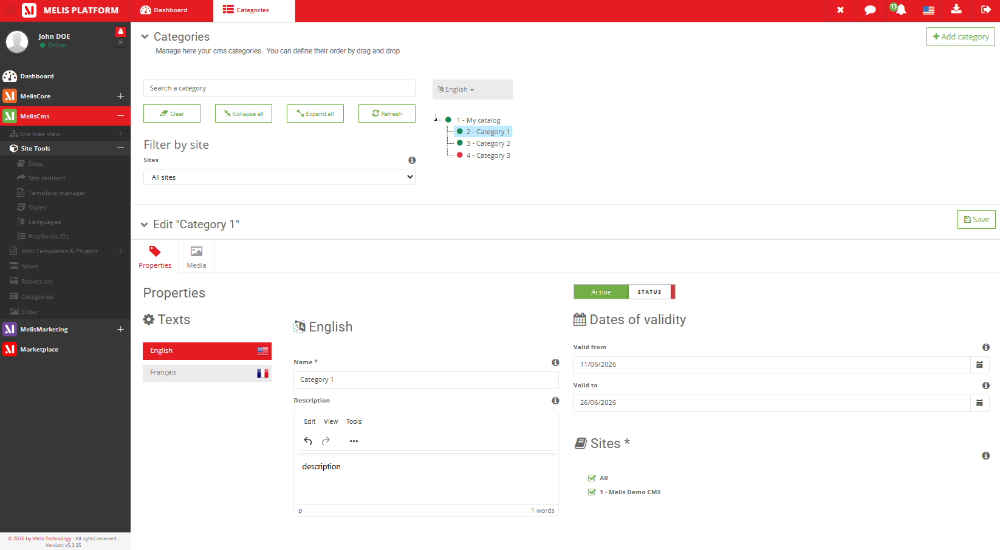
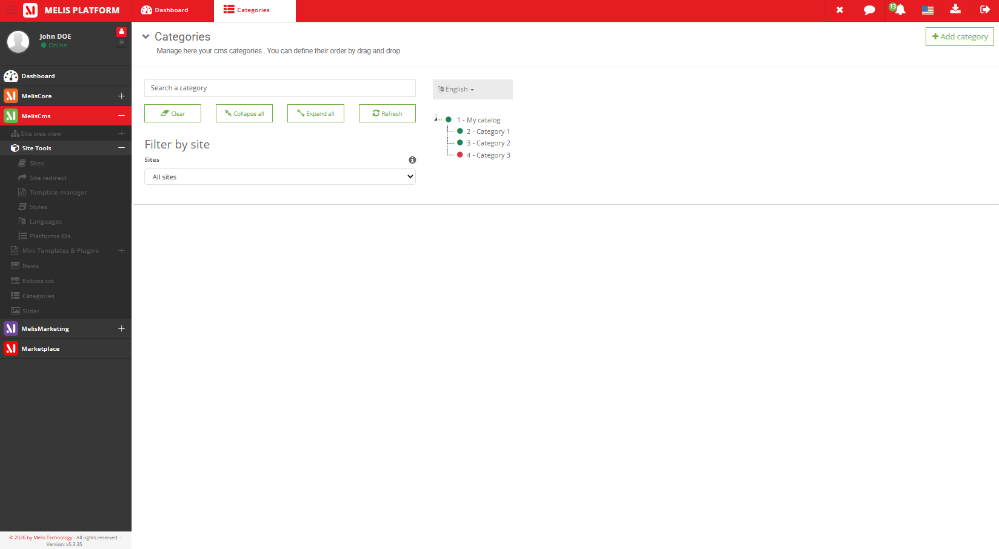
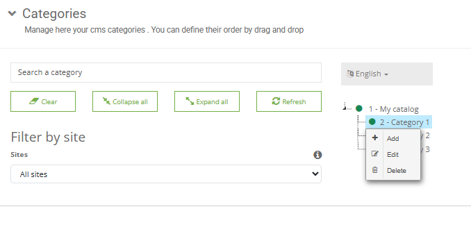
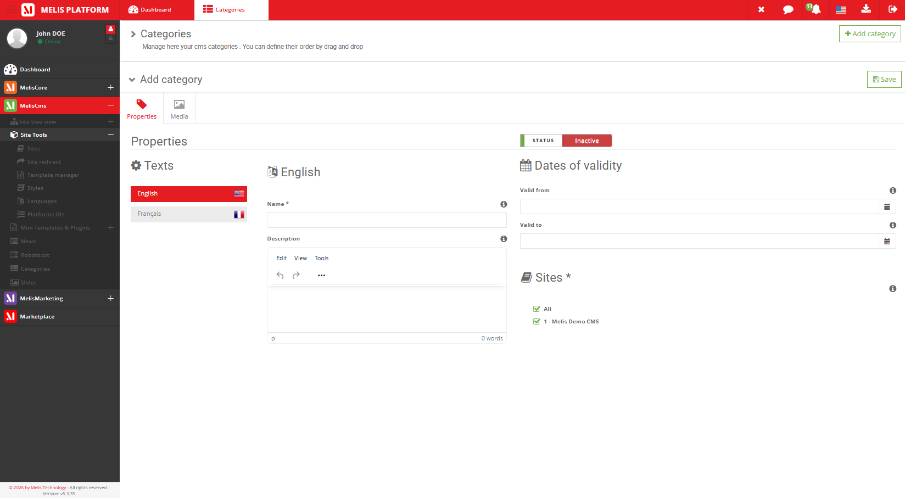
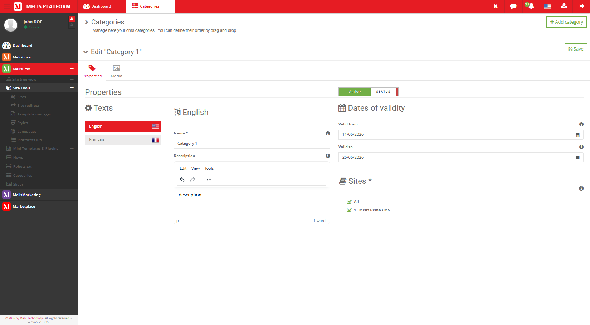
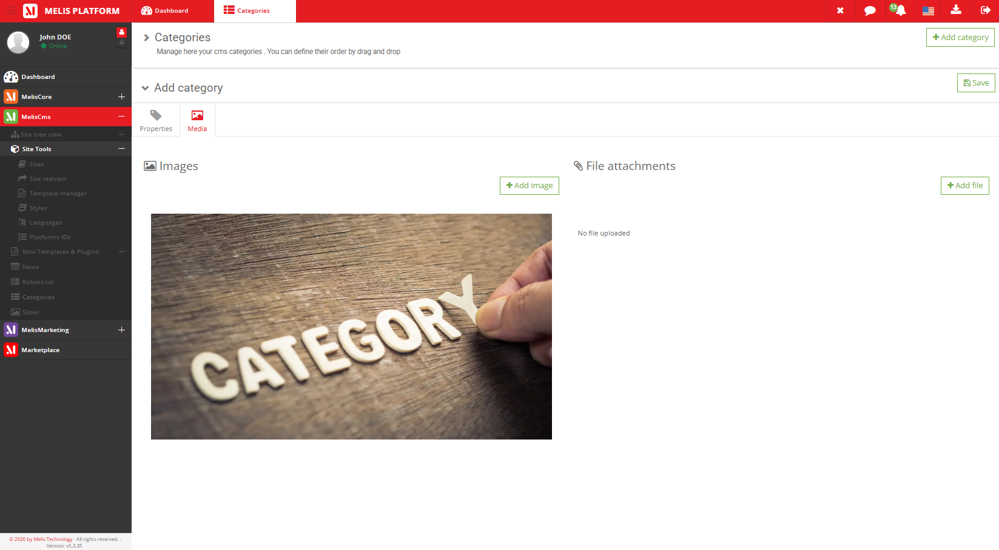
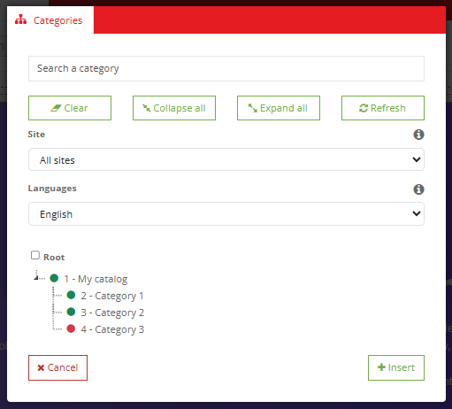

# MelisCmsCategory2 Module — Functional Documentation (for AI)

> **Purpose of this document**: describe, functionally and technically, the
> `melisplatform/melis-cms-category2` module, so that an AI (or a developer) can understand
> *what the module does*, *which tools it provides*, *how they work* and
> *where the corresponding code lives*.
>
> **Audience**: consumed by the **MelisAI** module (a MelisPlatform module that exposes an
> MCP function to answer user questions). MelisAI fetches this `.md` file and the
> screenshots in `./images/` **on demand** — so the doc is self-contained and §9 acts as
> the filename→content index for retrieving a specific screenshot.
>
> **Status**: reviewed 2026-06-08 against the current source. The module carries no
> semantic version (no `version` in `composer.json`), so treat this doc as describing the
> current `melisplatform/melis-cms-category2` source rather than a tagged release.
>
> Screenshots live in `./images/` (relative paths `./images/...`).

---

## 1. Overview

`MelisCmsCategory2` provides a **hierarchical category system** (a tree of categories /
catalogs) for the Melis platform, **fully multilingual and multisite**. Editors build and
organize a category tree in the back-office; each category carries per-language names and
descriptions, a set of sites it belongs to, validity dates, a status, and optional attached
media. Categories can be displayed on the front-office through a templating plugin, and the
category tree is exposed as a **reusable selector** that other modules embed to classify
their own entities.

| Item | Value |
|---|---|
| Package name | `melisplatform/melis-cms-category2` |
| Type | `melisplatform-module` |
| PHP namespace | `MelisCmsCategory2\` → `src/` (PSR-4) |
| Module name | `MelisCmsCategory2` |
| License | OSL-3.0 (per `composer.json`) |
| PHP required | `^8.1 | ^8.3` |
| Framework | Laminas (ex-Zend Framework 2/3), Melis MVC architecture |
| dbdeploy | `true` (DB migrations applied automatically) |
| Front tree UI | **jsTree** (`public/assets/jstree/`) |

> **License note**: `composer.json` declares **OSL-3.0**, while `README.md` references the
> *Melis Technology premium EULA*. The package metadata (OSL-3.0) is taken as authoritative
> here; flag the discrepancy to a human if licensing matters.

### Dependencies (required Melis modules)

Declared in `composer.json`:

- `melisplatform/melis-core` (`^5.2`) — foundation, services, events, rights, translations
- `melisplatform/melis-cms` (`^5.2`) — CMS, pages, sites

> The `README.md` additionally lists `melis-engine` (used for front rendering of the
> display plugin); it comes in through the standard Melis platform install.

### Optional integrations — the category system consumed by other modules

> This is the **only** place describing cross-module consumption. The module is the
> **provider** of a reusable **category selector** — the `MelisCmsCategorySelect` form
> element (factory `MelisCmsCategorySelectFactory`) and the category-select modal
> (`MelisCmsCategorySelectController`) — which consumer modules embed to attach their own
> records to a category. These light up only when the consuming module is installed:

- **News** — `MelisCmsNews` lets a news article be filed under categories from this tree
  (the news ↔ category link is its `melis_cms_news_category` table; the category tree and
  modal are served by this module).
- **Commerce / products** — the category edit screen includes a **Products** tab
  (`renderCategoryTabProductsAction`) and an **SEO** tab (`renderCategoryTabSeoAction`),
  which surface when a commerce/product module is present to assign products to a category.

On its own, the module's category tool, services and display plugin work fully.

---

## 2. Functional concepts

- **Category**: a node in a **tree** — it has a parent (`cat2_father_cat_id`, `-1` for a
  root) and an **order** among its siblings (`cat2_order`). A top-level/root category is a
  **catalog** (the list header offers both "Add catalog" and "Add category"). A category
  has a **status** (active/inactive), an optional **reference**, optional **validity dates**
  (start/end — when it should be shown), and creation/edit audit fields.
- **Translations** (multilingual): a per-language **name** and **description**
  (`melis_cms_category2_trans`).
- **Sites** (multisite): the set of sites a category belongs to
  (`melis_cms_category2_sites`).
- **Media**: images/files attached to a category (`melis_cms_category2_media`).

### Data model (MySQL tables)

| Table | Role | Primary key |
|---|---|---|
| `melis_cms_category2` | Category node: parent, order, status, reference, validity dates, audit | `cat2_id` |
| `melis_cms_category2_trans` | Per-language name + description of a category | `catt2_id` |
| `melis_cms_category2_sites` | Category ↔ site links (multisite) | `cats2_id` |
| `melis_cms_category2_media` | Media (image/file) attached to a category (`catm2_type`, `catm2_path`, `catm2_cat_id`) | `catm2_id` |

- A category's parent is `melis_cms_category2.cat2_father_cat_id` (self-referencing tree).
- A seed root category (`cat2_id = 1`, "My catalog" / "Mon catalogue") is inserted on install.
- MySQL Workbench model: `install/sql/Model/MelisCmsCategory2TableModel.mwb`
- Base structure: `install/sql/setup_structure.sql`
- Incremental migrations: `install/dbdeploy/*.sql`

---

## 3. Tools and elements provided

The module exposes:

1. **The Category tool (back-office)** — tree list + category editor (translations, status,
   validity, sites, media)
2. **A reusable category selector** — form element + select modal (for consumer modules)
3. **1 front-office templating plugin** — Display Categories
4. **Two application services** (category + media) and a tree view helper

---

### 3.1 Category tool (back-office)

Accessible from the Melis back-office left menu (icon `fa-th-list`, key
`melis_cms_category_v2`). Declared in `config/app.interface.php`.

#### a) The category tree (`MelisCmsCategoryList`)

- **Controller**: `src/Controller/MelisCmsCategoryListController.php`
- **Views**: `view/melis-cms-category2/melis-cms-category-list/*.phtml`

The list presents catalogs as an **accordion**, each panel holding a **jsTree** tree-view of
that catalog's category hierarchy. A **filter area** offers a **search input**
(`renderCategoryListSearchInputAction` / `searchCategoryTreeViewAction`) and a **site
filter** (`renderCategoryListSiteFilterAction`). The header offers **Add catalog**
(`renderCategoryListHeaderAddCatalogAction`, a new root) and **Add category**
(`renderCategoryListHeaderAddCategoryAction`, a child node). The tree is loaded via
`getCategoryTreeViewAction`; nodes can be **drag-reordered / re-parented**
(`saveCategoryTreeViewAction` → `reOrderCategories()` / `udpateCategoryTreeView`), and each
node exposes its own actions.


*Caption: the Category tool's main view — catalogs presented as an accordion, each panel
containing that catalog's category tree, with the search and site filters.*


*Caption: the jsTree hierarchy of a catalog's categories (expandable nodes, the full
multi-level tree).*


*Caption: the actions available on a tree node (add a child category, edit, delete, reorder).*

#### b) Editing a category (`MelisCmsCategory`)

- **Controller**: `src/Controller/MelisCmsCategoryController.php`
- **Views**: `view/melis-cms-category2/melis-cms-category/*.phtml`
- **Forms**: `config/app.forms.php`

Selecting a node opens the category editor — a **Properties** tab (icon `tag`) whose form
gathers:
- **Translations** (`renderCategoryFormTranslationsAction`): name + description **per
  language** (`melis_cms_category2_trans`)
- **Status** (`renderCategoryFormStatusAction`): active / inactive
- **Date validity** (`renderCategoryFormDateValidityAction`): start / end dates
- **Sites** (`renderCategoryFormSitesAction`): the sites the category belongs to

Saving goes through `saveCategoryAction` → `MelisCmsCategory2Service::saveCategory()` (+
`saveCategoryTexts`, `saveCategorySites`). Deletion: `deleteCategoryAction`. The editor may
also expose **Products** and **SEO** tabs when a commerce module is present (see §1). The
same editor is used for **creating** a new category and **editing** an existing one.


*Caption: creating a new category — the Properties tab with per-language name/description,
status, validity start/end dates and the sites the category belongs to.*


*Caption: editing an existing category — the same Properties tab populated with the
category's current values.*

#### c) Category media (`MelisCmsCategoryMedia`)

- **Controller**: `src/Controller/MelisCmsCategoryMediaController.php`
- **Views**: `view/melis-cms-category2/melis-cms-category-media/*.phtml`
- **Service**: `MelisCmsCategory2MediaService`

A **Media** tab to attach images/files to a category: browse/upload
(`browseMediaAction`, `uploadMediaAction`), list images/files
(`renderCategoryTabMediaContentLeftImageListAction`,
`renderCategoryTabMediaContentRightFileAction`), and delete (`deleteFileAction`). Records go
to `melis_cms_category2_media`.


*Caption: the category editor's Media tab — attach, browse, upload and remove images/files
for the category.*

---

### 3.2 Reusable category selector (for consumer modules)

- **Form element**: `MelisCmsCategorySelect` (factory
  `src/Form/Factory/MelisCmsCategorySelectFactory.php`) — a category picker other modules
  embed in their own forms.
- **Select modal**: `src/Controller/MelisCmsCategorySelectController.php`
  (`renderCategorySelectModalAction`, `renderCategorySelectModalContentAction`) — a modal
  tree picker.

This is the building block consumed by News / Commerce (see §1 *Optional integrations*).

---

### 3.3 Front-office plugin — Display Categories

- **Role**: render the categories of a site (from a chosen starting node) on a front page.
- **Controller Plugin**: `src/Controller/Plugin/MelisCmsCategoryDisplayCategoriesPlugin.php`
- **Config**: `config/plugins/MelisCmsCategoryDisplayCategoriesPlugin.config.php`
- **Rendering template**: `view/melis-cms-category2/plugins/default.phtml`
  (`MelisCmsCategory2/default`)
- **Config modal — 1 tab**:
  - **Properties** (`MelisCmsCategory2/plugin/modal/modal-template-form`): `template_path`,
    `site_id`, `category_start` (the node to start displaying from)

It can also be used **hardcoded** from a controller (see README) by calling
`$this->MelisCmsCategoryDisplayCategoriesPlugin()->render([...])` and adding the result as a
child view.


*Caption: Display Categories › Properties tab — rendering template, source site and the
starting category node (`category_start`).*


*Caption: the Properties tab's category picker — searching/selecting the `category_start`
node the plugin displays from.*

---

### 3.4 Application services

#### `MelisCmsCategory2Service` (`src/Service/MelisCmsCategoryService.php`)

The main category service. Selected public methods:

| Method | Role |
|---|---|
| `saveCategory(...)` | Create/update a category node |
| `saveCategoryTexts($categoryId, $catLangId, $postData, $id = null)` | Create/update a category's per-language translation |
| `saveCategorySites($categoryId, $siteId, $id = null, $tobeDeleted = false)` | Attach/detach a category to/from a site |
| `getCategoryById($categoryId, $langId = null, $onlyValid = false)` | Full category data |
| `getCategoryTreeview($fatherId = null, $langId = null, $onlyValid = false, $siteId = null)` | The category tree (optionally per site/lang, valid-only) |
| `getCategoryListByIdRecursive(...)` | A category and its descendants |
| `getCategoryNameById($categoryId, $langId = null, $exclude = false)` | A category's name |
| `getCategoryTranslationById($categoryId, $langId = null, $onlyValid = false)` | Translation rows |
| `getFirstLevelCategoriesPerSite($siteId, $langId = 1)` / `getCategoriesPerSite($siteId, $langId = 1)` | Categories for a site |
| `reOrderCategories($parentId, $currentOrder)` | Persist sibling ordering |
| `getCategoryMediaById($categoryId)` | A category's media |
| `validateDates($dateStart, $dateEnd)` | Validity-date check |

Retrieval from another module:

```php
$cmsCategorySvc = $this->getServiceManager()->get('MelisCmsCategory2Service');
$tree = $cmsCategorySvc->getCategoryTreeview($fatherId, $langId, $onlyValid, $siteId);
$cat  = $cmsCategorySvc->getCategoryById($categoryId, $langId, $onlyValid);
```

#### `MelisCmsCategory2MediaService` (`src/Service/MelisCmsCategoryMediaService.php`)

Media/file handling: `uploadFile`, `deleteFile`, `getMediaFilesByCategoryId`,
`getFilesInDir`, `removeCategoryDir`, `file_upload_max_size`, etc.

#### Tables (Table Gateways) & helpers

- Tables (aliases in `config/module.config.php`): `MelisCmsCategory2Table`,
  `MelisCmsCategory2TransTable`, `MelisCmsCategory2SitesTable`, `MelisCmsCategory2MediaTable`
  (in `src/Model/Tables/`); models in `src/Model/`, entity `src/Entity/MelisCategory.php`.
- View helper: `renderTreeRec` (`src/View/Helper/RenderRecTreeHelper.php`) — recursive tree
  rendering.

---

## 4. Extensions and integrations

### 4.1 Listener (`src/Listener/`)

| Listener | Role |
|---|---|
| `MelisCmsCategory2FlashMessengerListener` | Back-office interface flash messages (attached only when rendering the back-office) |

### 4.2 Diagnostic

- `config/diagnostic.config.php` — module health checks (Melis diagnostic system).

---

## 5. Front assets

- **Tree UI**: `public/assets/jstree/` (jsTree library + themes)
- **JS (tools)**: `public/js/tools/category.tool.js`, `category.media.tool.js`,
  `media.library.js`; TinyMCE tool translate `public/js/tinyMCE/toolTranslate.php`
- **CSS**: `public/css/categories.css`; plugin CSS under `public/plugins/css/`
- **Compiled bundle**: `public/build/css/bundle.css`, `public/build/js/bundle.js`

---

## 6. Internationalization

- Translation files: `language/en_EN.interface.php`, `language/fr_FR.interface.php`
- Category **content** itself is multilingual via `melis_cms_category2_trans` (name +
  description per language) — distinct from the interface translations.
- Translation loading: `Module::createTranslations()` (back-office vs front locale).

---

## 7. Quick code map

```
melis-cms-category2/
├── composer.json                 → module dependencies & metadata (dbdeploy: true)
├── config/
│   ├── module.config.php         → routes, services, tables, controllers, form element, view helper
│   ├── app.interface.php         → back-office interface tree (Category tool: list + editor tabs)
│   ├── app.forms.php             → category forms (translations, status, validity, sites)
│   ├── diagnostic.config.php     → diagnostic tests
│   └── plugins/                  → Display Categories plugin config + plugin form
├── src/
│   ├── Module.php                → bootstrap, flash listener, translations
│   ├── Controller/               → CategoryList, Category, CategoryMedia, CategorySelect, Plugin/
│   ├── Service/                  → MelisCmsCategoryService, MelisCmsCategoryMediaService
│   ├── Entity/                   → MelisCategory
│   ├── Model/ + Model/Tables/    → category, trans, sites, media models + table gateways
│   ├── Listener/                 → MelisCmsCategory2FlashMessengerListener
│   ├── Form/Factory/             → MelisCmsCategorySelectFactory (category selector)
│   └── View/Helper/              → RenderRecTreeHelper (recursive tree)
├── view/                         → .phtml templates (list, category editor, media, select, plugin)
├── public/                       → jsTree, JS/CSS assets, bundles, plugin images
├── language/                     → en_EN / fr_FR translations
├── install/                      → SQL (structure + seed, MWB model, dbdeploy migration)
└── etc/                          → MarketPlace (images/xml) + MelisAI/doc (this doc)
```

---

## 8. Typical category lifecycle

1. **Create a catalog** (root) from the tree header, then **add categories** as children.
2. **Edit** a category: enter per-language name/description, set status, validity dates and
   the sites it belongs to (Properties tab) → `saveCategory` + `saveCategoryTexts` +
   `saveCategorySites`.
3. **Attach media** (images/files) on the Media tab.
4. **Organize** the tree by drag-reordering / re-parenting nodes (`reOrderCategories`).
5. **Classify other records**: News/Commerce embed the `MelisCmsCategorySelect` element /
   select modal to file their entities under categories (see §1).
6. **Display on the front**: drop the **Display Categories** plugin into a page (pick site +
   starting node), or render it hardcoded from a controller.
7. **Delete** a category via `deleteCategoryAction`.

---

## 9. Screenshot index (for on-demand retrieval)

All screenshots live in `./images/` (i.e. `/etc/MelisAI/doc/images/`). This table is the
**filename → content** index the MelisAI MCP uses to fetch a specific screenshot on demand;
each row's caption in the body gives the text-only description of what the image shows.

| Image file | Content |
|---|---|
| `meliscmscategory2-tool-categories-accordionsystem.png` | Category tool — catalogs as an accordion (main view) |
| `meliscmscategory2-tool-categories-tab-treelist.png` | Category tool — the jsTree category hierarchy |
| `meliscmscategory2-tool-categories-tab-tree-actions.png` | Category tool — per-node tree actions (add child, edit, delete, reorder) |
| `meliscmscategory2-tool-categories-new-tab-properties.png` | Creating a category — Properties tab (translations, status, validity, sites) |
| `meliscmscategory2-tool-categories-edit-tab-properties.png` | Editing a category — Properties tab |
| `meliscmscategory2-tool-categories-new-tab-media.png` | Category editor — Media tab |
| `meliscmscategory2-page-plugin-categories-config-properties.png` | Display Categories plugin config — Properties tab |
| `meliscmscategory2-page-plugin-categories-config-properties-search-category.png` | Display Categories plugin config — Properties tab, start-category picker |

---

*Document for AI consumption (MelisAI MCP) — describes the `melisplatform/melis-cms-category2`
module. Last reviewed 2026-06-08 against the current source.*
